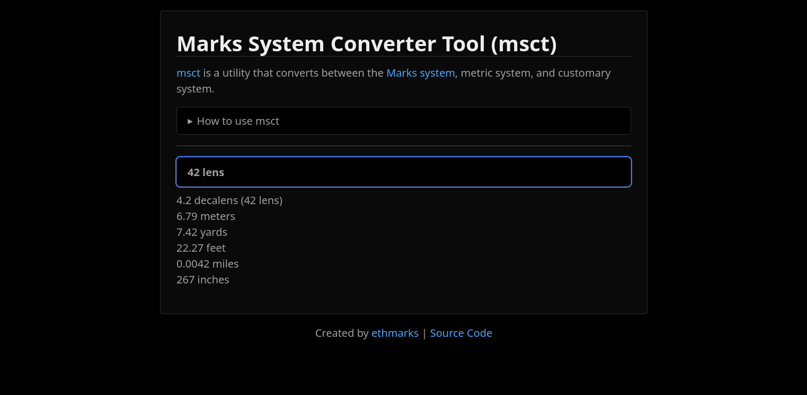

# msct



msct (Marks System Converter Tool) is a utility that converts between the [Marks system](https://site-ethmarks.vercel.app/posts/measurement), metric system, and customary system.

## Marks System

I've already written over 7,000 words about the Marks system in [this post](https://site-ethmarks.vercel.app/posts/measurement), so I won't describe it in depth here.

The relevant part to msct is that the Marks system specifies a few new units of measurement:

| Unit | Definition            |
| ---- | --------------------- |
| Tim  | 10^44 Planck times    |
| Len  | 10^34 Planck lengths  |
| Maz  | 10^8 Planck masses    |
| Vel  | 10^-10 speed of light |

The Marks system also specifies a few new SI prefixes, which are listed [here](https://site-ethmarks.vercel.app/posts/measurement#marks-prefixes).

## Usage

1. Visit <https://msct.vercel.app/>
2. Type a unit expression into the input field (if you need help, expand the "How to use msct" dropdown)
3. Read the output

## Why?

I wanted a tool that could natively handle Marks units so that my post's readers could experiment with the Marks system. Obviously, no existing unit conversion tool supported the Marks system, so I decided to make my own. msct is the result.

## Frontend

msct is a Vite+Svelte app using Deno. I chose to use native Vite instead of SvelteKit because I don't need _any_ of SvelteKit's features and I'd prefer to avoid the complexity and mild bloat that comes with it. Because it uses Vite+Svelte, msct is fully static, renders the page on the client side, and performs all computations in the browser.

msct uses [dev.css](https://devcss.devins.page/) for styling. dev.css is sleek, stylish, responsive, and (most importantly) is just a classless stylesheet that required a single-digit number of keystrokes to add.

## Backend

msct uses a custom TypeScript-based unit conversion engine, powered by `decimal.js`.

It's split into three sections: a vocabulary, a miniature conversion library, and a renderer.

### Vocabulary

[`vocab.ts`](./src/lib/vocab.ts) contains a vocabulary of 31 prefixes (some SI, some custom) and 29 units.

Each prefix has an id, a symbol, and a magnitude (stored as a 70-sigfig Decimal).

Each unit has an id, a plural, optionally some aliases, a system (e.g. "metric", "customary"), a takesPrefixes value, a dimensionality (e.g. "length", "time"), and a value in the corresponding Planck unit (Planck times, Planck lengths, Planck masses, and the speed of light).

The Planck unit values of each unit were sourced from either the unit definition (if it was defined in terms of Planck units), Wolfram Alpha, or from other units (e.g. the value of 1 minute equals the value of 1 second times times 60).

`vocab.ts` also precomputes `unitLookup`, a lookup table that matches strings to their corresponding prefix+unit combination. It creates combinations for each string in each unit (its id, plural, and any aliases) combined with each prefix (if that unit takes prefixes). At the time of writing, the final `unitLookup` is 1,250 items long.

### Conversion Library

[`convert.ts`](./src/lib/convert.ts) contains 12 main converter functions in addition to several helper functions.

Each converter function takes in a dimensionality and value (in the corresponding Planck unit) and outputs a coefficient + prefix + unit combination. For example, `speedOfLightToMPH()` takes in a value in terms of the speed of light and outputs a number corresponding to miles per hour.

`genericConvert()` acts as a barrel function that takes in any coefficient + prefix + unit combination, routes it to the correct conversion function, and returns the function's output.

### Renderer

[`App.svelte`](./src/App.svelte) contains a couple hundred lines of code for parsing user input, calling functions from `vocab.ts` and `convert.ts`, and smartly rendering `convert.ts`'s output into plain text.

The main pipeline takes the raw input string, passes it through `parseInput()`, computes the list of units compatible with the parsed input unit, converts the parsed input to each of the compatible units, formats each converted quantity into ready-to-display text, and returns the result as a list of strings to be displayed.

As a sample of what some of the helper functions do, `normalizeScientificNotation()` uses a black magic regex to convert the various different formats for scientific notation into the format that `decimal.js` prefers and will most reliably parse.

## Development

First, [install Deno](https://docs.deno.com/runtime/getting_started/installation/) if you haven't already. Then, run the following commands to download msct, start the dev server, and open it in your browser. Deno will automatically install the necessary dependencies.

```sh
git clone https://github.com/ethmarks/msct.git
cd msct
deno task dev
```

Once the dev server is running, open <http://localhost:5173/> in your browser.

## Example

Given the input "29032 feet" (the height of Mount Everest), msct gives the following output:

> 5.47 myrialens (54,750 lens) \
> 5.5 miles \
> 8.85 kilometers (8,849 meters) \
> 9,677 yards \
> 29,032 feet \
> 348,384 inches

## Troubleshooting

If msct emits an incorrect conversion (please verify it via Wolfram Alpha) or if it fails to parse an input that it should be able to parse, please let me know by [opening an issue](https://github.com/ethmarks/msct/issues).

## License

Licensed under an Apache 2.0 License. See [LICENSE](LICENSE) for more information.
